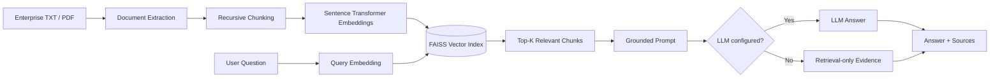

# Enterprise Document Intelligence & RAG Assistant

> **Production-style RAG portfolio project** for grounded question answering over enterprise documents using Python, LangChain, FAISS, embeddings, and an optional LLM.

[](https://github.com/varunreddy-16/enterprise-document-rag-assistant/actions/workflows/ci.yml)

## Why this project

Enterprise teams often have policies and internal documentation spread across files. Keyword search can miss the meaning of a question, while an LLM without retrieval can invent answers. This project combines **semantic retrieval + grounded generation** so responses are based on the most relevant document passages.

## What it demonstrates

- **Document ingestion:** TXT and PDF files with source/page metadata
- **Chunking:** recursive character splitting with configurable overlap
- **Embeddings:** local `sentence-transformers/all-MiniLM-L6-v2`
- **Vector search:** FAISS similarity search
- **RAG orchestration:** LangChain document and prompt abstractions
- **Grounding:** context-only answering with an explicit insufficient-evidence fallback
- **LLM integration:** optional OpenAI-compatible chat model
- **UI:** Streamlit question-answering interface with source references
- **Evaluation:** Recall@K retrieval benchmark
- **Testing:** pytest unit tests
- **CI:** GitHub Actions test workflow

> **Data note:** every document in `data/documents/` is synthetic demonstration data. No confidential enterprise data is included.

## Architecture



## Project structure

```text
.
├── app.py
├── data/
│   ├── documents/              # synthetic enterprise policies
│   └── evaluation/             # retrieval benchmark questions
├── scripts/
│   ├── build_index.py          # build local FAISS index
│   └── evaluate_retrieval.py   # Recall@K evaluation
├── src/rag_assistant/
│   ├── config.py
│   ├── ingestion.py
│   ├── embeddings.py
│   ├── vector_store.py
│   ├── prompts.py
│   └── rag_pipeline.py
├── tests/
├── .github/workflows/ci.yml
├── .env.example
├── pyproject.toml
└── requirements.txt
```

## Quick start

### 1. Install

```bash
python -m venv .venv

# Windows
.venv\Scripts\activate

# macOS/Linux
source .venv/bin/activate

pip install -r requirements.txt
```

### 2. Build the index

```bash
python scripts/build_index.py
```

The FAISS index is generated locally and intentionally ignored by Git.

### 3. Run the app

```bash
streamlit run app.py
```

The app works in **retrieval-only mode** without an API key. To generate grounded natural-language answers, copy `.env.example` to `.env` and configure an OpenAI-compatible provider.

### 4. Run evaluation and tests

```bash
python scripts/evaluate_retrieval.py
pytest -q
```

## Example questions

Try questions such as:

- What is the password rotation requirement?
- How quickly must employees report phishing?
- Who approves a software purchase of INR 100000?
- What is the annual learning allowance?
- How many weeks of parental leave are provided?
- How many days of annual leave are available?

## Retrieval evaluation

The repository includes a small labeled benchmark in `data/evaluation/retrieval_questions.json`. The evaluation script reports **Recall@K**, measuring whether at least one relevant source document is retrieved within the top K results.

Run:

```bash
python scripts/evaluate_retrieval.py
```

The result should be treated as a demonstration benchmark rather than a production-quality evaluation because the dataset is intentionally small and synthetic.

## Configuration

Key environment variables are documented in `.env.example`:

```text
OPENAI_API_KEY=
OPENAI_MODEL=gpt-4o-mini
OPENAI_BASE_URL=
TOP_K=4
CHUNK_SIZE=700
CHUNK_OVERLAP=100
```

## Design decisions

### Why RAG instead of direct LLM prompting?

The application retrieves relevant passages before generation. This reduces the amount of irrelevant context presented to the model and provides an evidence trail for each answer.

### Why local embeddings?

Embeddings are generated locally, avoiding the need for a second external API during indexing and making the demo easier to reproduce.

### Why FAISS?

FAISS provides a lightweight, fast local vector index that is appropriate for a portfolio-scale demonstration and can later be replaced with a managed vector database.

### Why synthetic documents?

The project is designed to demonstrate the architecture without exposing real company policies, employee information, or confidential material.

## Limitations and production next steps

This is a portfolio demonstration, not a production enterprise deployment. A production implementation would additionally need:

- authentication and authorization
- document-level access control
- PII/secret detection and redaction
- document versioning and incremental indexing
- managed vector storage
- observability and tracing
- prompt/model versioning
- stronger evaluation datasets and human review
- citation validation and answer-quality monitoring
- rate limiting and cost controls

## Tech stack

**Python · LangChain · FAISS · Sentence Transformers · Hugging Face · OpenAI-compatible LLMs · Streamlit · PyPDF · pytest · GitHub Actions**

## License

MIT License. See `LICENSE`.